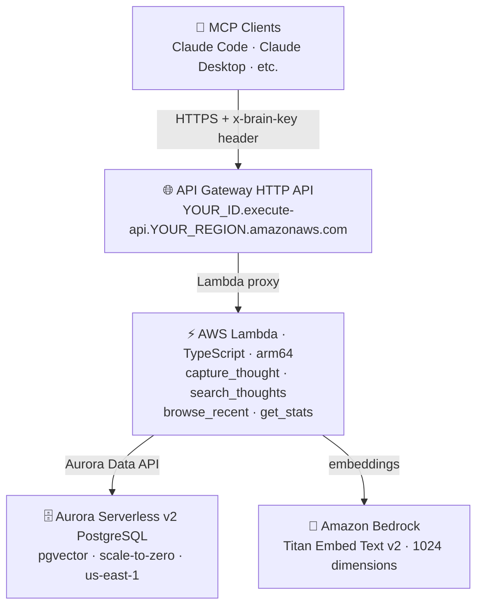

# OpenBrain — Persistent AI Memory for MCP Clients

A self-hosted persistent memory system running on AWS. A PostgreSQL database with
pgvector stores memories as vector embeddings. A Lambda function exposes 4 MCP tools
over HTTPS. Any MCP-compatible AI (Claude Code, Claude Desktop) can search and
capture memories through it.

**You own the data. You own the infrastructure. Zero platform lock-in. Estimated cost: under $1/month for personal use.**

---

## Architecture



---

## Folder Structure

```
openbrain/
├── README.md                  ← this file
├── SETUP.md                   ← step-by-step build guide
├── proxy.mjs                  ← stdio↔HTTP bridge (published as openbrain-proxy on npm)
├── infra/
│   ├── schema.sql             ← Aurora PostgreSQL schema (vector(1024))
│   └── iam-policy.json        ← Lambda IAM inline policy template
├── lambda/
│   ├── package.json
│   ├── tsconfig.json
│   └── src/
│       ├── index.ts           ← Lambda handler + MCP server
│       ├── tools/
│       │   ├── capture.ts     ← capture_thought tool
│       │   ├── search.ts      ← search_thoughts tool
│       │   ├── browse.ts      ← browse_recent tool
│       │   └── stats.ts       ← get_stats tool
│       └── lib/
│           ├── aurora.ts      ← Aurora Data API client
│           └── bedrock.ts     ← Bedrock embeddings client
└── docs/
    └── mcp-config.md          ← Claude Code / Claude Desktop / VS Code MCP config
```

---

## Quick Start

See [SETUP.md](SETUP.md) for the full step-by-step build guide.

Once deployed, connect any MCP client using `npx openbrain-proxy` — no file copy or repo clone needed:

```json
{
  "servers": {
    "openbrain": {
      "type": "stdio",
      "command": "npx",
      "args": ["openbrain-proxy"],
      "env": {
        "OPENBRAIN_KEY": "your-brain-key",
        "OPENBRAIN_URL": "https://YOUR_ID.execute-api.YOUR_REGION.amazonaws.com/mcp"
      }
    }
  }
}
```

See [docs/mcp-config.md](docs/mcp-config.md) for VS Code, Claude Desktop (Windows/Mac), and Claude Code configs.

---

## MCP Tools

| Tool | Description |
|---|---|
| `capture_thought` | Embed content + INSERT into Aurora |
| `search_thoughts` | Vector similarity search via pgvector |
| `browse_recent` | SELECT latest N thoughts |
| `get_stats` | COUNT and metadata |

---

## Cost Profile

| Service | Est. monthly cost |
|---|---|
| Aurora Serverless v2 (scale-to-zero) | ~$0.01–0.05 (storage only when idle) |
| Lambda | Free (1M req/month free tier) |
| Bedrock Titan Embed v2 | ~$0.00002/1K tokens |
| SSM Parameter Store | Free (standard tier) |
| **Total** | **under $1/month for light personal use** |

> ⚠️ Set up AWS Budgets alert ($5/month) before creating any resources.

---

## Key Concepts

- **"Two doors, one table"** — both you AND your agent read/write the same Aurora table
- **Architecture is portable, tools are not** — learn the pattern, not the specific stack
- **"Heartbeat" via /loop** — agent acts on a schedule without you being the trigger
- **Semantic search** — pgvector finds thoughts by meaning, not just keywords

---

## Gotchas (Learned the Hard Way)

### 1. Titan Embed Text v2 uses 1024 dimensions, not 1536
The Bedrock Titan Embed Text **v1** produced 1536-dim vectors. **v2** supports 256, 512, or 1024 — with 1024 as the default/max. Use `vector(1024)` in the schema and pass `{ dimensions: 1024, normalize: true }` in the Bedrock payload.

### 2. Lambda Function URL public access is blocked by default (late 2024+)
AWS introduced account-level "Block Public Access" for Lambda Function URLs. It is on by default for new accounts. A Function URL with `AuthType=NONE` + correct resource policy still returns `403 Forbidden`. The setting can be disabled in **Lambda Console → Account Settings → Block Public Access**, but there is no stable CLI/SDK API for it yet. **Use API Gateway HTTP API instead** — same cost (free tier), zero friction.

### 3. RDS-managed secret ARN format breaks IAM wildcards
When creating Aurora with `--manage-master-user-password`, the Secrets Manager secret is named `rds!cluster-<uuid>-<suffix>`, not anything predictable. A wildcard like `openbrain-aurora-secret-*` will not match it. Use the exact ARN in the IAM policy (get it from `describe-db-clusters` after cluster creation).

### 4. The `!` in the secret ARN breaks bash double-quoting
The `!` character triggers bash history expansion inside double quotes. Always pass the secret ARN inside single-quoted `--cli-input-json` when using the Data API or Secrets Manager from the CLI:
```bash
aws rds-data execute-statement --cli-input-json '{"secretArn":"arn:...rds!cluster-..."}'
```

### 5. Windows Git Bash rewrites `/aws/...` paths
CLI arguments starting with `/aws/` get translated to Windows paths `C:/Program Files/Git/aws/...`. Prefix the command with `MSYS_NO_PATHCONV=1` when tailing CloudWatch log groups:
```bash
MSYS_NO_PATHCONV=1 aws logs tail /aws/lambda/openbrain --region us-east-1
```

### 6. Aurora cold-start: `DatabaseResumingException`
With `MinCapacity=0`, Aurora scales to zero after ~5 minutes of inactivity. The first Data API call after a pause returns `DatabaseResumingException`. Simply retry after ~8 seconds — Aurora resumes fast. This is expected and free; no action needed.

### 7. Mac Claude Desktop doesn't inherit shell PATH (nvm users)
Claude Desktop on Mac launches processes without your shell's `PATH`. This means `npx openbrain-proxy` silently resolves `node` to the system version (potentially Node 14/16), which fails with `ReferenceError: fetch is not defined` since `openbrain-proxy` requires Node 18+.

**Fix:** Don't use `npx`. Point `command` directly at your nvm Node binary and `args` at the proxy script:
```json
{
  "command": "/Users/you/.nvm/versions/node/vX.X.X/bin/node",
  "args": ["/Users/you/.nvm/versions/node/vX.X.X/lib/node_modules/openbrain-proxy/proxy.mjs"]
}
```
See `docs/mcp-config.md` for full setup steps.

---

## Credits

The concept and architecture behind OpenBrain are directly inspired by the work of **Nate B Jones**.
I would not have been able to build this without his videos — highly recommended watching if you want
to understand the *why* before building your own.

- [Why 2026 is the year to build a second brain (and why you need one)](https://www.youtube.com/watch?v=0TpON5T-Sw4)
- [They ignored my tool stack and built something better — the 4 patterns that work](https://www.youtube.com/watch?v=_gPODg6br5w)
- [One simple system gave all my AI tools a memory. Here's how](https://www.youtube.com/watch?v=japT66frdhM)
- [Anthropic just gave your AI agent the one thing OpenAI has — without the risk](https://youtu.be/vqnAOV8NMZ4?si=-cfc8ba5NLBkH9qH)
